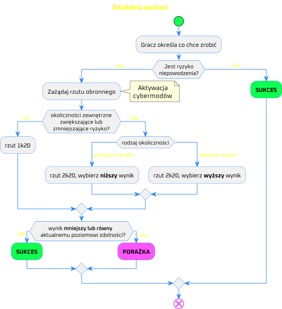
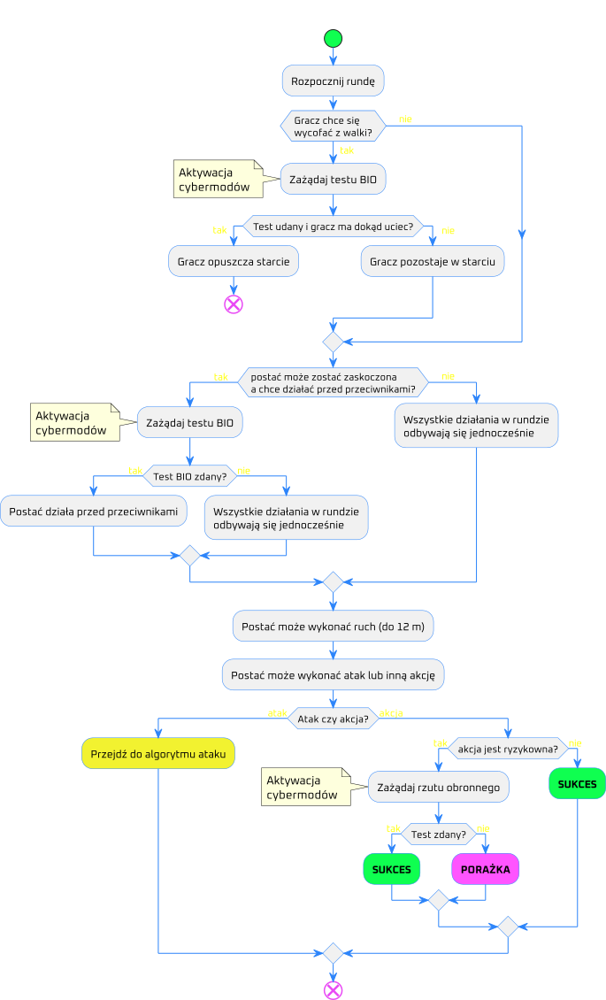
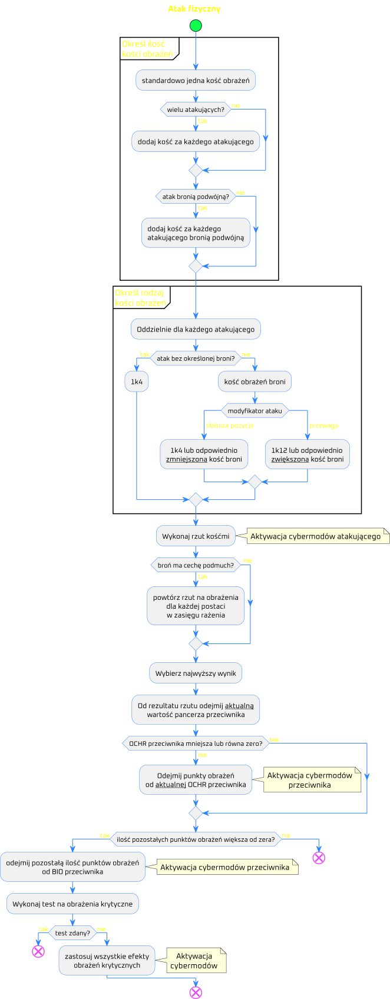
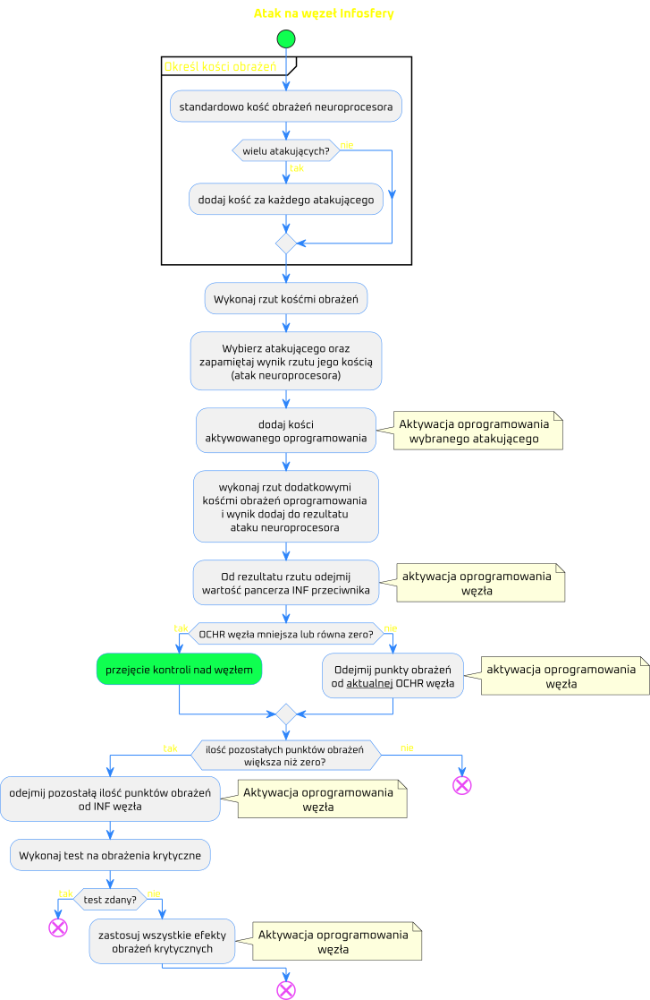
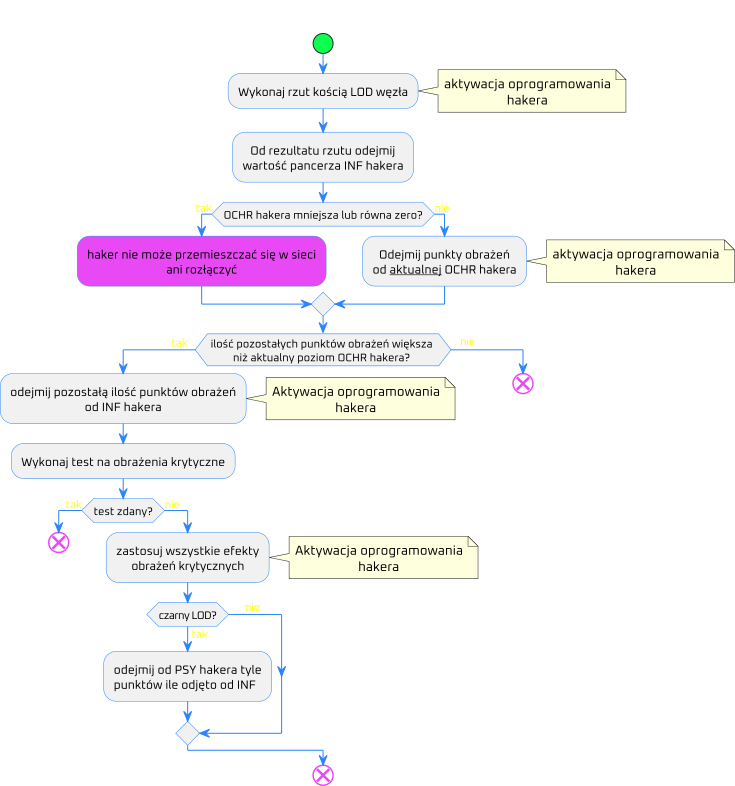

# Infosfera

## Generator węzła Infosfery

1. Określ lub wylosuj klasę bezpieczeństwa
2. Określ współczynniki i zabezpieczenia
3. Wybierz lub wylosuj wygląd jeśli chcesz
4. Wybierz lub wylosuj dane przechowywane w węźle

<!-- [Wersja generatora online](https://oswida.github.io/cyber/app/dist/#/gen?lang=pl&mode=Infosphere) -->

## Klasa bezpieczeństwa

1. Publiczny
2. Prywatny
3. Prywatny strzeżony
4. Rządowy
5. Korporacyjny
6. Wojskowy
7. SI

## Współczynniki i zabezpieczenia

Każdy węzeł Infosfery posiada współczynniki OCHR i INF oraz dodatkowe parametry związane z jego ochroną.
Zredukowanie OCHR węzła do zera oznacza przejęcie kontroli, zredukowanie INF do zera - zniszczenie danych.
Poniższa tabela opisuje współczynniki i zabezpieczenia dla poszczególnych klas bezpieczeństwa.

- `OCHR` i `INF` podają kość jakiej należy użyć do wylosowania wartości atrybutu (modyfikator przy OCHR zapewnia pewien bazowy poziom dla danej klasy)
- `LOD` określa kość ataku dla Logicznego Oprogramowania Defensywnego oraz określa szansę na to, że dany LOD będzie czarny (rzucamy Kością Przeznaczenia, x/6 oznacza, że wyniki od 1 do x dają odpowiedź pozytywną)
- `Próg aktywacji` informuje o maksymalnej wartości, która aktywuje program ochronny w danej rundzie.

| Klasa              | OCHR  |  INF  | Próg aktywacji |       LOD        |
| ------------------ | :---: | :---: | :------------: | :--------------: |
| Publiczny          | k4+1  |  k4   |       1        |        k4        |
| Prywatny           | k4+1  |  k4   |       2        |        k4        |
| Prywatny strzeżony | k6+2  |  k6   |       3        |        k6        |
| Rządowy            | k8+3  |  k8   |       5        | k8, 1/6: Czarny  |
| Korporacyjny       | k10+4 |  k10  |       7        | k10, 2/6: Czarny |
| Wojskowy           | k12+5 |  k12  |       9        | k12, 3/6: Czarny |
| SI                 | k20+6 |  k20  |       12       | k20, 4/6: Czarny |

### Oprogramowanie ochronne

Każdy z węzłów może mieć dodatkowo oprogramowanie ochronne. Jego aktywacja nie musi być nieuchronna i zależy od wyniku rzutu podczas ataku LOD.
Procedura nie wymaga żadnego dodatkowego rzutu kością - wartość brana jest z rzutu ataku LOD, jeśli wynik jest mniejszy lub równy progowi aktywacji, w tej samej rundzie następuje uruchomienie programu a jego typ pobiera się z tabeli oprogramowania ochronnego, również na podstawie wartości wyrzuconej podczas ataku.

| k4 - k20 | Oprogramowanie ochronne ()                               |
| :------: | -------------------------------------------------------- |
|    1     | OCHR +1 (*)                                              |
|    2     | OCHR +2 (*)                                              |
|    3     | OCHR +3 (*)                                              |
|    4     | Pancerz +1                                               |
|    5     | Pancerz +2                                               |
|    6     | Pancerz +3                                               |
|    7     | Rozproszenie: następny atak hakera jest osłabiony        |
|    8     | Obrażenia krytyczne: dodatkowe obrażenia k4              |
|    9     | Obrażenia krytyczne: atak hakera osłabiony na k4 rund    |
|    10    | Obrażenia krytyczne: haker odłączony od sieci na k4 rund |
|    11    | Zapora: niemożność hakowania w następnej rundzie         |
|    12    | Podwójny atak (rzut dwiema kośćmi, wybierz wyższy wynik) |

(*) Jeśli haker kontrolował węzeł,w momencie zwiększenia OCHR, traci tę kontrolę, dopóki nie zredukuje ponownie OCHR węzła do zera.

> Przykład aktywacji oprogramowania ochronnego
> 
> Ian atakuje węzeł korporacyjny, co oznacza, że LOD ma kość ataku k10. 
> Dodatkowo, podczas losowania na k6 wypadło 2 co oznacza, że atakowany LOD jest "czarny" (w przypadku porażki w teście na obrażenia krytyczne, Ian otrzyma dodatkowo obrażenia PSY)
> W momencie ataku, na kości LOD wypada 5. Oznacza to, że:
> - Ian otrzyma **5 punktów obrażeń** (najpierw odejmuje je od OCHR a następnie od swojego INF)
> - Został **aktywowany** dodatkowy program ochronny (próg aktywacji 7) 
> - Efektem działania programu ochronnego jest **+2 pancerza** w tej rundzie (**pozycja 5** w tabeli), obrażenia zadane węzłowi przez Iana zostaną zredukowane o 2 (atak hakera i węzła są rozliczane jednocześnie)  

## Wygląd (3 razy k20)

| k20 | Kształt                | Kolor i/lub materiał             | Szczegół                                        |
| --- | ---------------------- | -------------------------------- | ----------------------------------------------- |
| 1   | Kula                   | Rubinowy, przezroczysty          | Promienie lasera wypełniające kształt           |
| 2   | Piramida/ziggurat      | Przezroczysty                    | Symbole matematyczne wyświetlane na powierzchni |
| 3   | Symbol nieskończoności | Czarny, matowy                   | Płonie jaskrawym światłem                       |
| 4   | Sześcian               | Srebrny                          | Świetlne pierścienie wirujące naokoło           |
| 5   | Makieta budynku        | Zielony, neonowy                 | Slogany reklamowe wyświetlane na powierzchni    |
| 6   | Maska                  | Biały, połyskliwy                | Przypominający origami                          |
| 7   | Menhir                 | Czarny, połyskliwy               | Wypełniony błyskawicami                         |
| 8   | Krąg                   | Błękitny, jarzący się            | Wypełniony kryształkami lodu                    |
| 9   | Model atomu            | Szary, kamienny                  | Bez żadnych dodatkowych oznaczeń                |
| 10  | Logo                   | Błękitny, zamglony               | Wielkie logo firmy/właściciela                  |
| 11  | Wstęga Moebiusa        | Zielony, świetlisty              | Świecące sześciany w środku                     |
| 12  | Kostka Rubika          | Czerwony, płomienny              | Mistyczne symbole wirujące naokoło              |
| 13  | Ekran                  | Wielokolorowy                    | Losowo pojawiające się plamki światła           |
| 14  | Wir                    | Złoty                            | Losowe obrazy z sieci wyświetlane wewnątrz      |
| 15  | Kolumna                | Metalowy, lśniący                | Opleciony metaliczną siatką                     |
| 16  | Trójkąt                | Ciemnoniebieski, pokryty smugami | Błyskający regularnie przyćmionym światłem      |
| 17  | Oko                    | Szklany, przezroczysty           | Wirujący wokół własnej osi                      |
| 18  | Brama                  | Kłębiący się, brunatny           | Obracające się ciągle segmenty                  |
| 19  | Trapezoid              | Pomarańczowy, jaskrawy           | Dynamiczne fraktale rysowane na powierzchni     |
| 20  | Prostopadłościan       | Stalowy, pokryty symbolami       | Co jakiś czas znika i pojawia się               |

## Dane do zdobycia (k20)

Jeśli twoi hakerzy włamują się do węzłów Infosfery w celu zdobycia cennych danych, poniższe tabele mogą być inspiracją.

### Publiczny

1. Zestaw starych gier komputerowych
2. Wielka księga przepisów kulinarnych
3. Plany budynku użyteczności publicznej
4. Odpowiedzi na pytania w najbliższym quizie multimedialnym
5. Cheaty do popularnej gry online
6. Receptura na domowy wyrób stymulantów
7. Tomik wierszy wątpliwej jakości
8. Bardzo ciekawe projekty modnych ubrań
9. Lista zwycięzców konkursu piękności, który się jeszcze nie odbył
10. Największa na świecie kolekcja muzyki
11. Nieznane, zaszyfrowane dane
12. Zapis z kamer bezpieczeństwa budynku publicznego
13. Grafik zajęć znanej gwiazdy medialnej
14. Nagranie brutalnej interwencji policji
15. Nagranie protestów aktywistów pod bramą fabryki
16. Nagranie z manifestem grupy terrorystycznej
17. Oficjalne oświadczenie grupy hakerskiej
18. Pełne dane medyczne dotyczące leku na znaną chorobę
19. Plany techniczne drona policyjnego
20. Lista skorumpowanych policjantów  

### Prywatny

1. Dane medyczne ukradzione ze szpitala Administracji
2. Plany techniczne nieznanego cybermodu
3. Kolekcja filmów ... różnego rodzaju
4. Zestaw artykułów o tajemniczych eksperymentach genetycznych
5. 1k4 wejściówek na znane wydarzenie sportowe
6. Zestaw 1k4 wirusów komputerowych
7. Rękopis niewydanej powieści (może być dobra)
8. Kody wejściowe do prywatnego mieszkania
9. Korespondencja z korporacją dotycząca odszkodowania
10. Archiwum danych na temat znanego celebryty
11. Dokumentacja medyczna wskazująca na nieuleczalną chorobę
12. Kody uruchamiające do prywatnego pojazdu
13. Redagowany manifest grupy terrorystycznej
14. Poradnik jak wykonać bombę
15. Kolekcja maili miłosnych
16. Autoryzowany testament
17. Zaproszenia na wesele i lista gości
18. Zdjęcia z nielegalnej kliniki cybertechnicznej
19. Amatorskie nagranie z włamu
20. Nieznany utwór słynnego zespołu muzycznego

### Prywatny strzeżony

1. Komplet fałszywych dokumentów
2. 1k4 fałszywych sygnatur dla pojazdów dowolnego typu
3. Dane konta bankowego z 1k4 tys. kredytów
4. 1k4 biletów na najbliższy koncert w operze
5. 1k6 programów hakerskich różnego rodzaju
6. Kody do hakowania linii energetycznych w wybranej dzielnicy
7. Kody wejściowe do kilku mieszkań w zwykłym wieżowcu
8. Adresy rodzin szefów znanych gangów
9. Dwa karnety do ekskluzywnej restauracji
10. Kody wejściowe do prywatnego garażu
11. Hasła do korporacyjnego konta pocztowego
12. Elektroniczny klucz do skrytki z bronią k6
13. Pamiętnik ważnego polityka
14. Lista kontaktów gwiazdy medialnej
15. Adres sieciowy członka zarządu korporacji
16. Kod wejściowy do jednej z korporacyjnych arkologii
17. Hasło do konta z platynowym abonamentem podstawowym
18. Kody dostępowe do skrytki z nielegalnymi stymulantami
19. Adres kontaktowy do znanego pasera
20. Dokument odbioru cybermodu / drona bojowego

### Rządowy

1. Kody otwierające wszystkie drzwi wybranego urzędu Administracji
2. Zapis z kamer bezpieczeństwa z nagraną zbrodnią
3. Plany ewakuacji w przypadku epidemii nieznanej publicznie choroby zakaźnej
4. Raport o zmutowanych zwierzętach napotykanych przez pracowników komunalnych
5. Zeznania finansowe znanych polityków
6. Ultimatum grupy terrorystycznej grożącej skażeniem chemicznym
7. Dane finansowe wskazujące na zbliżający się kryzys gospodarczy
8. Raport o skażeniu radioaktywnym w jednej z dzielnic miasta
9. Informacje o wygaśnięciu praw korporacji do gruntów zajmowanych przez fabrykę
10. Szczegółowe plany wybranej dzielnicy miasta
11. Akt własności niewielkiej posesji miejskiej
12. Kody wejściowe do systemu szpitala Administracji
13. Raport o dziwacznym zachowaniu SI zarządzającej transportem miejskim
14. 1k6 uprawnień do prowadzenia środków komunikacji miejskiej (in blanco)
15. Kalendarz wyłączenia linii energetycznych w poszczególnych częściach miasta
16. Projekt nowej ustawy podatkowej dla obywateli
17. Kody wejściowe do magazynu szpitala miejskiego
18. Hasła i kody, które wprowadzają stan zagrożenia epidemiologicznego
19. 1k4 czystych formularzy pozwalających na rejestrację tożsamości
20. Kody dostępowe do systemu sterowania wybranymi usługami komunalnymi

### Korporacyjny

1. Najnowsze, jeszcze nie emitowane odcinki popularnego serialu
2. Kompromitujące nagrania ważnego pracownika korporacji
3. Dokładne plany jednej z korporacyjnych arkologii
4. Dane osobowe całego działu korporacyjnego
5. Wykaz kont bankowych znanego pracownika korporacji
6. Dokumentacja produkcyjna rzadkiej szczepionki
7. Dane pracowników podejrzewanych o szpiegostwo
8. Teczki osobowe pracowników konkurencyjnej korporacji
9. Zestaw przepustek wejściowych do arkologii
10. Kompromitujące dane polityków
11. Dane techniczne najnowszego produktu firmy
12. Informacje o finansowaniu grup terrorystycznych
13. Lista policjantów na usługach korporacji
14. Lista urzędników Administracji na usługach korporacji
15. Plany przejęcia kontroli nad gangami w danej dzielnicy
16. Kontakty do osób/firm wynajmowanych do 'mokrej roboty'
17. Dokumentacja nielegalnych eksperymentów genetycznych
18. Hasła do magazynu pełnego produktów korporacji
19. Zlecenia transportu nieznanych materiałów do placówki badawczej
20. Plany korporacyjnej placówki badawczej

### Wojskowy

1. Plany techniczne drona bojowego
2. Kody wejściowe do bazy wojskowej
3. Zdalne kody sterujące do myśliwca wojskowego
4. Program deszyfrujący transmisje w sieci taktycznej
5. Plany techniczne robota wojskowego
6. Kody wejściowe do magazynu broni
7. Przepustka do magazynu wojskowych cybermodów
8. Dane adresowe ważnych dowódców wojskowych
9. Dokumentacja produkcyjna wojskowych stymulantów
10. Kody sterujące satelity wojskowego
11. Zdjęcia z satelity pokazujące nielegalne placówki badawcze
12. Lista szpiegów konkurencji w wybranej korporacji
13. Rozkazy eksterminacji ludności w przypadku zagrożenia nieznaną chorobą
14. Dokumentacja zabójczego wirusa hodowanego w laboratorium
15. Plany rozmieszczenia głowic nuklearnych
16. Zapisy rozmów ze spotkań zarządu wybranej korporacji
17. Lista korporacyjnych SI postrzeganych jako zagrożenie
18. Plany techniczne superlekkiego działka EMP
19. Plany techniczne cyberkończyny z emiterem EMP
20. Lista szpiegów wojskowych w korporacjach

### SI

1. Konstrukt (zapis osobowości) zmarłego celebryty
2. Dane techniczne węzła Agencji Energii Atomowej
3. Kody źródłowe innej SI
4. Kody wejściowe do wszystkich systemów policyjnych
5. Zestaw 1k6 potężnych wirusów komputerowych
6. Hasło do węzła całkowicie odpornego na hakowanie
7. Hasło do anonimowego konta z 1k20 tys. kredytów
8. Procedura jednorazowego dostępu do dowolnego węzła w Infosferze
9. Wirus, który na 1k20 minut wyłącza systemy bezpieczeństwa we wskazanym budynku
10. Kody kontrolne automatycznego pojazdu wojskowego
11. Kody kontrolne systemu komunikacji miejskiej
12. Receptura na uzależniające stymulanty k10
13. Kody międzykontynentalnej rakiety z głowicami jądrowymi
14. Dane medyczne eksperymentu związanego z ludzką nieśmiertelnością
15. Dane tajnej placówki badawczej hodującej ludzkie mutanty
16. Wirus całkowicie blokujący transmisje wybranej sieci medialnej
17. Tajne plany wojskowe dotyczące ataku na jedną z korporacji
18. Dowody na to, że jedną z korporacji całkowicie zarządzają SI
19. Plan ataku na Infosferę, który mają przeprowadzić zbuntowane SI
20. Destrukcyjny wirus, natychmiastowo kasujący wszystkie dane na węźle, na którym go uruchomiono

# Algorytmy podstawowe

## Akcja gracza

## Walka fizyczna

## Atak na węzeł w Infosferze

## Atak LOD

# Algorytmy dodatkowe 

Kilka dodatkowym mechanizmów pozwalających rozbudować rozgrywkę w Infosferze.

## Starcia pomiędzy hakerami

Podstawowa wersja gry zakłada, że hakerzy mogą atakować węzły w Infosferze oraz być atakowani przez Logiczne Oprogramowanie Defensywne.
Co się jednak stanie, jeśli w sieci spotka się kilku hakerów stojących po przeciwnych stronach? 
Neuroprocesor daje hakerowi dużo większe możliwości operowania Infosferą ale jednocześnie naraża go na bezpośrednie ataki z sieci.

Istnieje możliwość zaatakowania jaźni hakera w podobny sposób jak to się dzieje z węzłami Infosfery. 
Akcję taką musi wykonać inny haker, nie może tego dokonać żadne oprogramowanie. Istnieją pogłoski, że niektórym SI 
również zdarzało się atakować bezpośrednio umysł człowieka.

Starcie odbywa się na zasadach identycznych jak w przypadku węzłów. Oponenci **atakują za pomocą neuroprocesorów** a obrażenia zadawane są najpierw w OCHR a potem INF przeciwnika. Ataki odbywają się jednocześnie.
Zredukowanie OCHR hakera do zera lub poniżej oznacza, że druga strona może **przejąć kontrolę nad bodźcami** odbieranymi przez pokonanego na **tyle rund ile wynosi jej aktualny INF**.
Przejęcie kontroli dotyczy jedynie sensorium hakera (wzrok, słuch, węch), nie obejmuje motoryki, czyli nie można sterować ciałem przeciwnika. Ale można za to całkowicie kontrolować jego postrzeganie.

## Wspomaganie

Jeśli dwu lub więcej hakerów zechce skoordynować swoje działania podczas ataku na węzeł, ich działania rozliczane są podobnie jak wielu atakujących w regułach dotyczących walki.
Rzuć **wszystkimi** kośćmi obrażeń i zachowaj jeden **wybrany** wynik.
Różnica w stosunku do walki fizycznej (tam wybiera się najwyższy wynik) wynika z tego, że hakerzy mogą modyfikować efekt ataku za pomocą programów. W momencie rozliczania ataku, pod uwagę brane są **tylko te programy**, które aktywował **właściciel wybranego rzutu**.

## Pasażerowie

Każdy haker może połączyć ze swoim neuroprocesorem dowolną ilość zwykłych urządzeń dostępowych. W ten sposób, osoby postronne, nie posiadające neuroprocesora, mogą mieć z nim stały kontakt a nawet obserwować jego poczynania w sieci. Nikt z pasażerów nie może jednak podejmować żadnej akcji w Infosferze, ich udział ogranicza się jedynie do biernej obserwacji lub komunikacji z hakerem.
